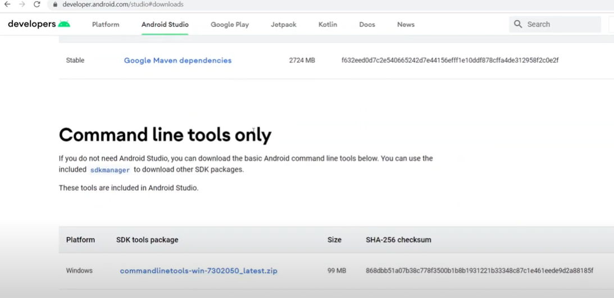

1. install Java and setup JAVA_HOME
   C:\Program Files\Java\jdk-21
2. install Nodejs
   C:\Program Files\nodejs paste in path env
3. dowload appium 1.20.2
npm i appium@latest -g
4. Download and setup Android SDK command line tools ONLY
 
create tools folder then copy bin and lib into tools

create android and sdk folder in C:\users\«urrent-username>\AppData\Local\Android\sdk

Setup ANDROID_HOME and ANDROID_SDK_ROOT
   C:\Users\vuvan\AppData\Local\Android\sdk

5.setup path

6.sdkmanager platform-tools emulator
sdkmanager --sdk_root=<path_to_sdk_root> platform-tools emulator
-> After this step we will see platform-tools and emulator folder under same location with cmdline-tools at  
-> Check adb command to make sure
•
. Extend PATH to have platform-tools, emulator, cmdllne-tools/tool/bin

7. Install Packages for AVD (system.images, platforms, build.tools)

• sdkmanager --list

• sdkmanager "platforms; android-29" (https://developer.android.com/studio/releases/platforms)

• sdkmanager "system-images;android-29;default;x86"

• sdkmanager "build-tools;29.0.2" (https://developer.android.com/studio/releases/build-tools)

8. Create AVD

• avdmanager create avd --name android_29 --package "system-images;android-29;default;x86"

9. json config appium

{
    "platformName": "Android",

    "deviceName": "android_29",

    "app": "C:\\Users\\vuvan\\OneDrive\\Desktop\\java\\appium-cucumberbdd-2.0\\src\\test\\resources\\apps\\Android.SauceLabs.Mobile.Sample.app.2.7.1.apk",
   
    "automationName": "UiAutomator2",
       
    "appPackage": "com.swaglabsmobileapp",
       
    "appWaitActivity": "com.swaglabsmobileapp.MainActivity"
}
10. Launch Emulator by using commandline tools

    emulator @android_29

11. AppiumSession

a. Mở cmd trong folder chứa apk

b. Lấy tên device: adb devices

    name: emulator-5554

c. Cài ứng dụng lên máy: adb install Android.SauceLabs.Mobile.Sample.app.2.7.1.apk

d. Lấy thông tin ứng dụng: Mở app -> login app -> adb shell "dumpsys window | grep mCurrentFocus"
   appPackage:
   appWaitActivity:

12. dowload maven and unzip
 put path C:\Users\vuvan\Downloads\apache-maven-3.9.4-bin\apache-maven-3.9.4\bin

13. run project

    mvn test -Dos=android
14.
